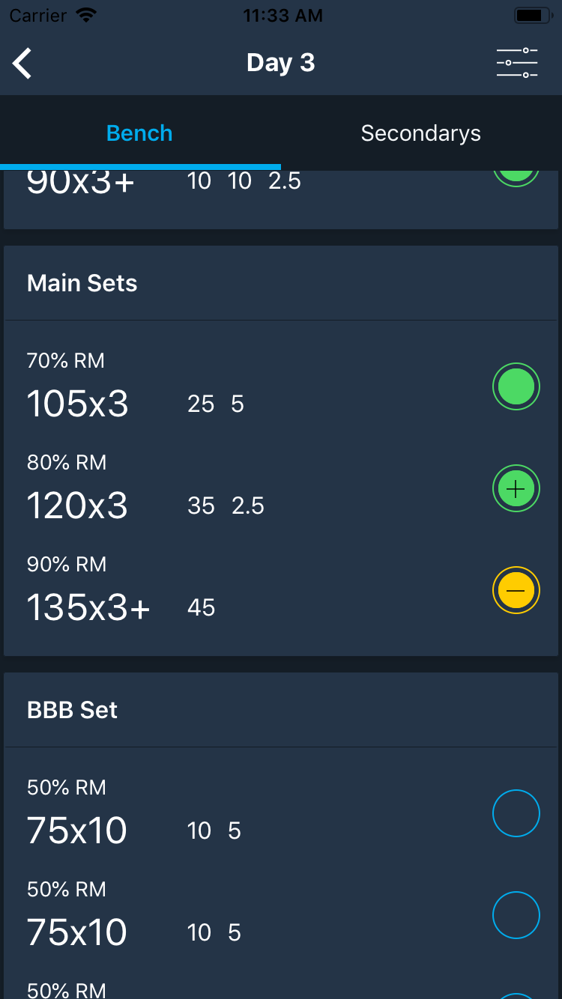
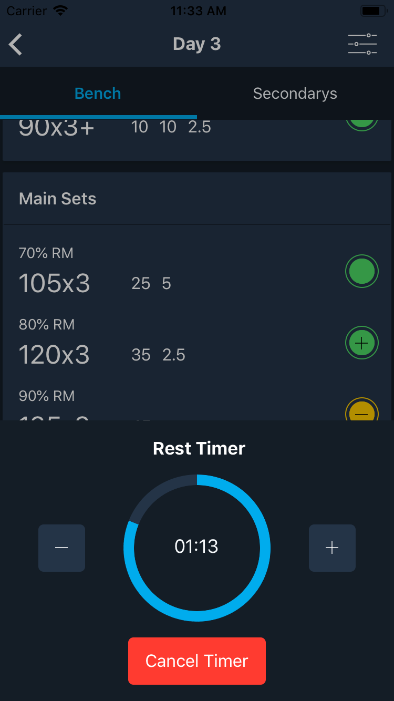
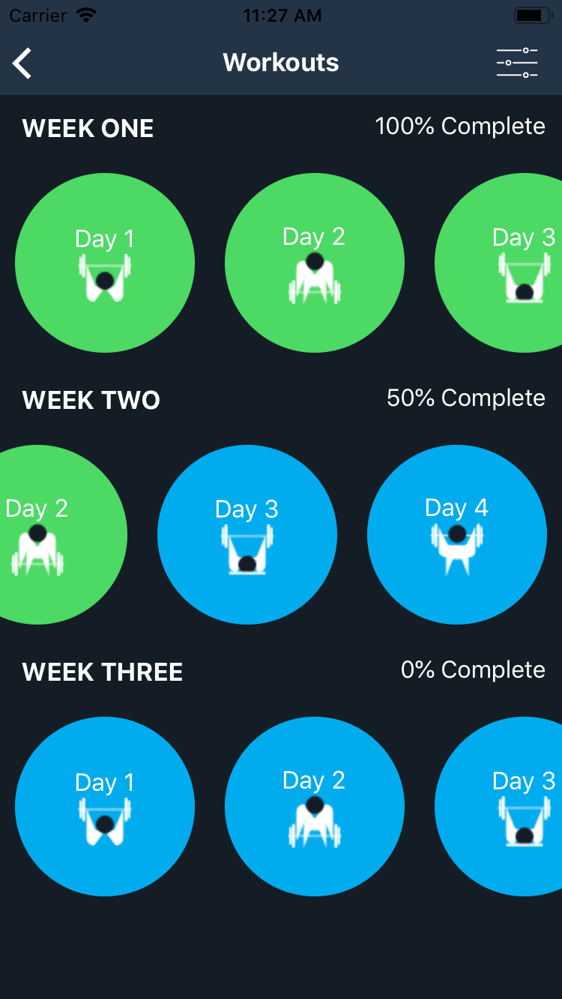
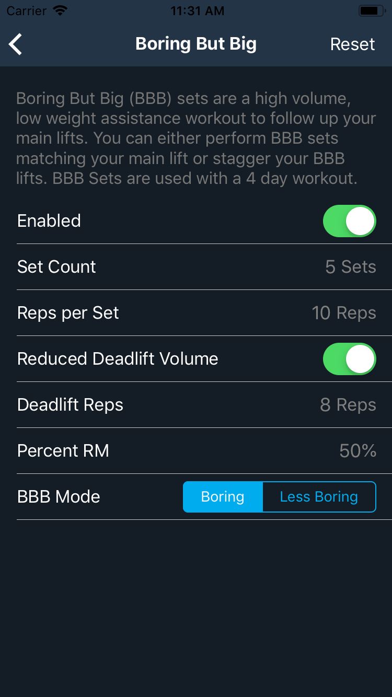
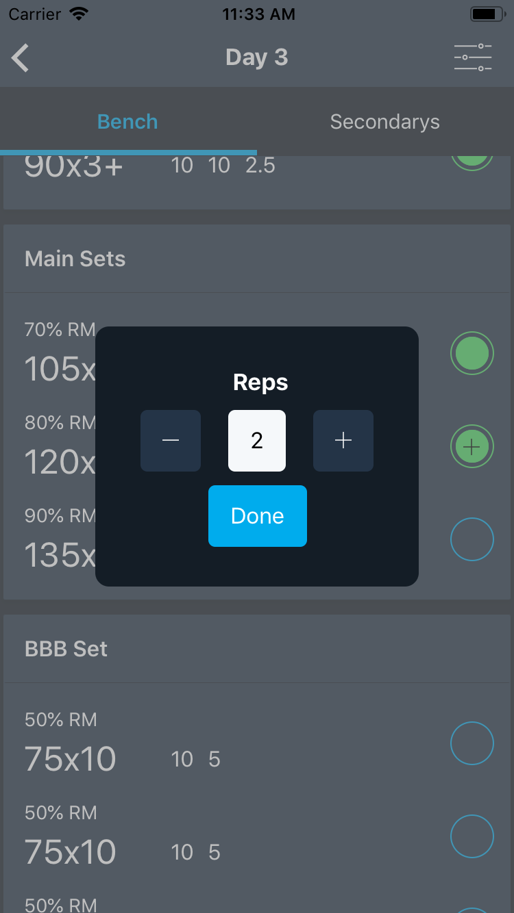

# BigBoi 531

A 531 program companion app built in React Native & Expo. The 531 Program is a strength training routine created by [Jim Wendler](https://jimwendler.com/). This app allows you to create a customized routine and follow the 531 program the way you want. Featuring tons of custimization options such as Boring But Big variations, assistance workout tracking, warmup sets and more.

Key features include:

- Customizable rest timers
- Local notifications for timers when app is in background
- Plate loading calculations (shows what weights to load on each side of the bar)
- First set last (FSL) variations
- Pyramid set variations
- Joker set variations
- Boring But Big variations
- Support for 3 day beginner routine and other non-standard routines

Application is still in development and currently not available in the App store. Proobbbbbaly not going to keep the current name.

## Screenshots

    
    
    
    
    

